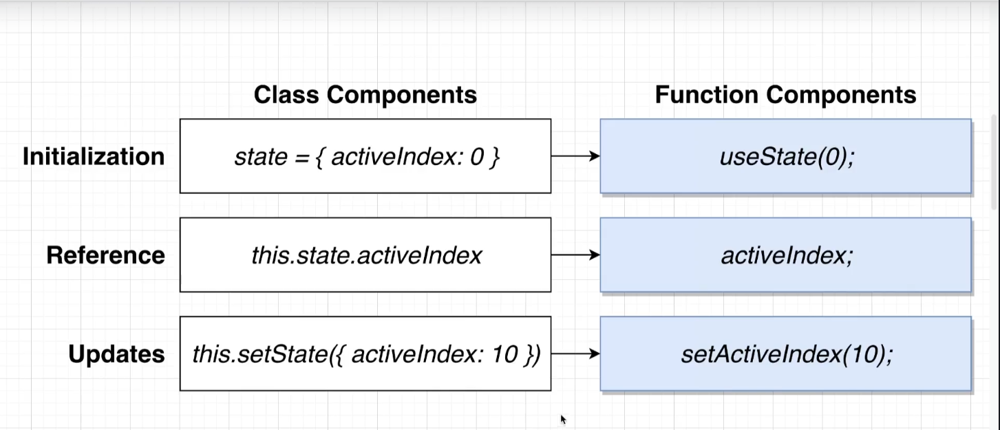

# Modern React with Redux

---

## Create React App

```bash
npm i -g create-react-app
```

## Dependencies Old Setup

```bash
npm i --save-dev @babel/cli @babel/core @babel/plugin-proposal-class-properties \
  @babel/plugin-proposal-export-default-from @babel/plugin-transform-runtime \
  @babel/polyfill @babel/preset-env @babel/preset-react \
  babel-eslint babel-jest babel-loader babel-plugin-module-resolver \
  babel-plugin-transform-class-properties babel-plugin-transform-runtime \
  babel-polyfill

npm i --save-dev eslint eslint-config-standard eslint-plugin-import eslint-plugin-node \
  eslint-plugin-promise eslint-plugin-react eslint-plugin-standard

npm i --save-dev webpack webpack-cli webpack-dev-server html-webpack-plugin postcss-flexbugs-fixes \
  browserslist copy-webpack-plugin@^5.1.1

npm i --save-dev style-loader css-loader file-loader react-hot-loader \
  postcss postcss-flexbugs-fixes@^4.2.1 postcss-loader@^3.0.0 \
  postcss-preset-env autoprefixer

npm i react react-dom babel-plugin-transform-decorators-legacy axios bootstrap
```

```json
"scripts": {
    "test": "echo \"Error: no test specified\" && exit 1",
    "webpack": "webpack --config webpack.config.js",
    "build": "npm run webpack",widgets
    "start": "webpack-dev-server --open"
  }
```

## Dependencies ReactJS 17.x Setup

[Link Git](https://github.com/abhidatta0/react17-webpack-setup/blob/master/src/app.jsx)

```bash
npm i webpack webpack-cli webpack-dev-server --save-dev

npm i @babel/core @babel/preset-env @babel/preset-react babel-loader \
  @babel/cli @babel/plugin-proposal-class-properties  \
  @babel/plugin-proposal-export-default-from \
  @babel/plugin-transform-runtime @babel/preset-env @babel/preset-react \
  babel-loader babel-plugin-module-resolver --save-dev

npm i css-loader html-loader sass-loader style-loader html-webpack-plugin \
  react-hot-loader file-loader copy-webpack-plugin mini-css-extract-plugin --save-dev

npm i eslint eslint-config-airbnb eslint-plugin-import eslint-plugin-node \
  eslint-plugin-promise eslint-plugin-react eslint-plugin-jsx-a11y \
  sass --save-dev

npm i react react-dom bootstrap core-js@^3 jquery@1.9.1 popper.js@^1.16.1

npm i react react-dom

npm i axios
```

## Utils

[Faker JS](https://github.com/marak/Faker.js/)
[Babel IO](https://babeljs.io)
[List Free Apis](https://mixedanalytics.com/blog/list-actually-free-open-no-auth-needed-apis/)
[Random Memes API](https://api.imgflip.com/get_memes)

## React Component Lifecycle (Ordered)

1. constructor
2. render
3. componentDidMount
4. componentDidUpdate
5. componentWillUnmount

## React Hooks composition

- useState
  > Function that lets you use **state** in a functional component 
- useEffect
  > Function that lets you use _something_ like **lifecycle methods** in a functional component
- useContext
- useReducer
- useCallBack
- useMemo
- useRef
- useImperativeHandle
- useLayoutEffect
- useDebugValue

## React v17 capture:true

```javascript
useEffect(() => {
  document.body.addEventListener(
    "click",
    () => {
      setOpen(false);
    },
    { capture: true }
  );
}, []);
```

```javascript
useEffect(() => {
  const onBodyClick = (event) => {
    if (ref.current.contains(event.target)) {
      return;
    }
    setOpen(false);
  };
  document.body.addEventListener("click", onBodyClick, { capture: true });

  return () => {
    document.body.removeEventListener("click", onBodyClick, {
      capture: true,
    });
  };
}, []);
```
